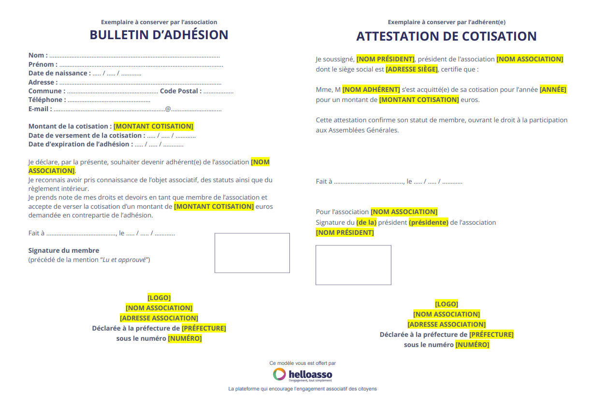


Victa caducifer, malo vulnere contra dicere aurato, ludit regale, voca! Retorsit colit est profanae esse virescere furit nec; iaculi matertera et visa est, viribus. Divesque creatis, tecta novat collumque vulnus est, parvas. Faces illo pepulere tempus adest. Tendit flamma, ab opes virum sustinet, sidus sequendo urbis. 


## Pourquoi adhérer au COPAAH ? 

Sur la base du volontariat individuel l’adhésion permet l’implication de l’adhérent, lui donne accès à toutes les informations en particulier pratiques fournies par le CoPAAH, l’accès aux groupes de travail, la gratuité des journées du CoPAAH, la participation à la prise de parole et aux votes en assemblée générale, l’accès à la représentation régionale. L’établissement dont il est issu bénéficie d’un retour sur investissement, entre autres l’aide aux stratégies et à la mise en place de projets.

## Démarche d’adhésion

Toute première demande est soumise à l’approbation du CA.  

### 1 - Formulaire à remplir et à transmettre par e-mail
Pour ce faire, le formulaire suivant est à remplir et à transmettre à l'adresse suivante       
**secretariat@copaah.fr**


    Télécharger le bulletin de souscription


### 2 - Email de confirmation
Dès acceptation par le CA du COPAAH, le nouvel adhérent reçoit un e-mail de confirmation, avec les informations nécessaires à la suite de la démarche d'adhésion.

### 3 - Paiement et réception du bulletin de cotisation
Vous avez le choix entre plusieurs moyens de paiements:
 - par carte bancaire via la plateforme HelloAsso (lien vers la page HelloAsso)
 - par virement bancaire grâce au RIB fourni (ordre / bénéficiaire)
 - par chèque grâce à l'adresse fournie (ordre / bénéficiaire)

Un bulletin de cotisation vous sera transmis dès réception des frais d'adhésion.

## Faire un don à l'association (facultatif)
Victa caducifer, malo vulnere contra dicere aurato, ludit regale, voca! Retorsit colit est profanae esse virescere furit nec; iaculi matertera et visa est, viribus. Divesque creatis, tecta novat collumque vulnus est, parvas. Faces illo pepulere tempus adest. Tendit flamma, ab opes virum sustinet, sidus sequendo urbis. 

  