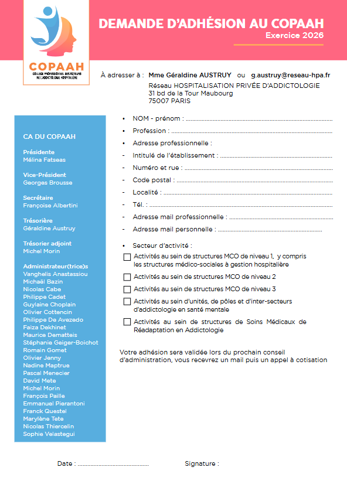

<!-- ## Pourquoi adhérer au COPAAH ?  -->


Sur la base du volontariat individuel l’adhésion permet l’implication de l’adhérent, lui donne accès à toutes les informations en particulier pratiques fournies par le COPAAH, l’accès aux groupes de travail, la gratuité des journées du COPAAH, la participation à la prise de parole et aux votes en assemblée générale, l’accès à la représentation régionale et au CA sur candidature. L’établissement dont il est issu bénéficie d’un retour sur investissement, entre autres l’aide aux stratégies et à la mise en place de projets. Plus nous sommes intéressés, nombreux et pluriprofessionnels plus notre réflexion est riche et entendue.


## Démarche d’adhésion

Toute première demande est soumise à l’approbation du CA.  

### 1 - Formulaire à remplir et à transmettre par e-mail

Pour ce faire, le formulaire suivant est à remplir et à transmettre à l’adresse suivante
**tresorerie@copaah.fr**, mettre en copie également **secretariat@copaah.fr**  

<!--  -->




    Télécharger le formulaire


### 2 - Email de confirmation
Dès acceptation par le CA du COPAAH, le nouvel adhérent recevra un e-mail de confirmation, avec les informations nécessaires à la suite de la démarche d'adhésion, et notamment un lien vous donnant accès à la page de l'association hebergée sur [la plateforme HelloAsso](https://www.helloasso.com/associations/college-professionnel-des-acteurs-de-l-addictologie-hospitaliere). 

### 3 - Paiement et réception du bulletin de cotisation
Un lien vers le paiement de l'adhésion en ligne vous sera transmis. 

[Exemple de lien reçu par email suite à une demande d'adhésion validée](https://www.helloasso.com/associations/college-professionnel-des-acteurs-de-l-addictologie-hospitaliere/adhesions/adhesion-copaah-20262027)

Il n'est pas accessible directement sur la plateforme pour faciliter la démarche de demande d'adhésion et éviter les adhésions non validées par le CA. Pour des raisons diverses, seuls les paiements par carte bancaire sont désormais acceptés.

Les règlements par virement bancaire, par chèque ou en espèces ne sont plus acceptés sauf cas de force majeure.

Une attestation de cotisation vous sera transmise dès réception des frais d’adhésion. 

## Faire un don à l'association (facultatif)

Le COPAAH n’ayant comme ressources que les cotisations de ses adhérents, tout don de la part de ses membres et partenaires est évidemment le bienvenu.  

